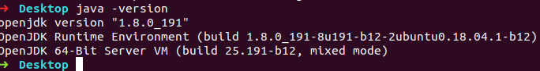
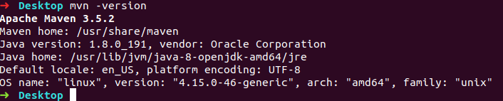
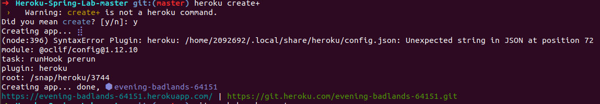
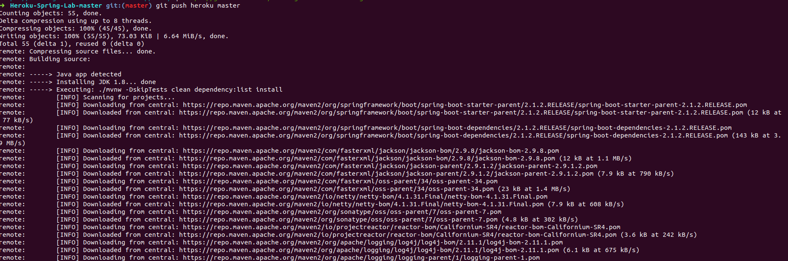
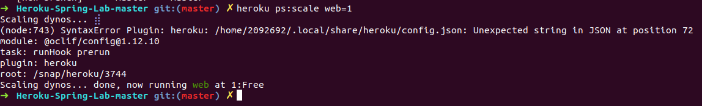
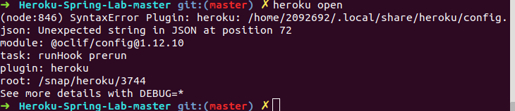
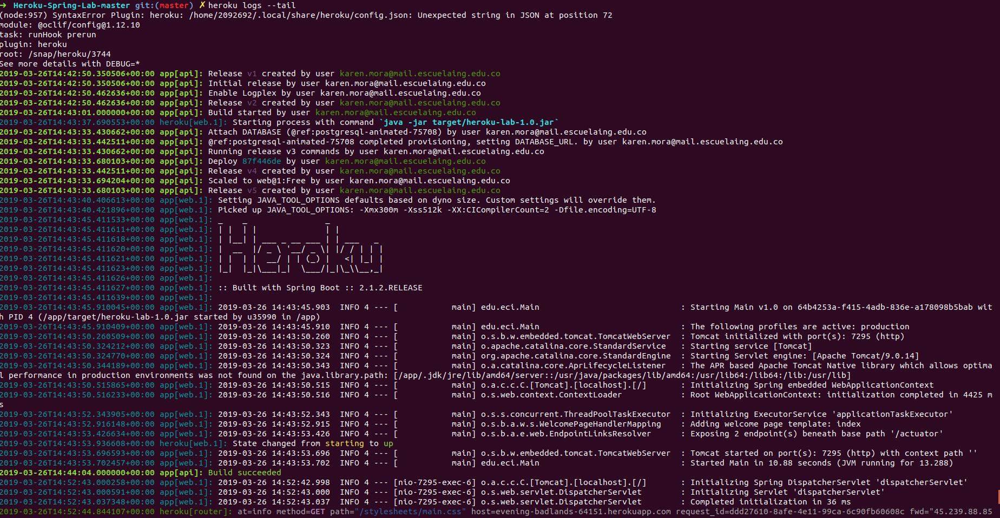

# java-getting-started

# Introduction
This tutorial will have you deploying a Java app in minutes. Hang on for a few more minutes to learn how it all works, so you can make the most out of Heroku. The tutorial assumes that you already have:
- A free Heroku account
- Java 8 installed
- Maven 3 installed

- TASK
		- For all the commands executed on the terminal, take a screenshot and describe the output.
# Prepare the app
In this step, you will prepare a sample application that’s ready to be deployed to Heroku. Download the sample app. You now have a functioning Git repository that contains a simple Java application. The application includes a pom.xml file, which is used by Java’s dependency manager, Maven.

- TASK

		- Execute the app in localhost. (Add screenshot)
		- What the application do?
		- Describe the REST services exposed by the application.
		- For what purpose is the Procfile plaintext file? 

# Deploy the app
In this step you’ll deploy the sample app to Heroku. First, create an app on Heroku, which prepares Heroku to receive your source code "heroku create".

When you create an app, a Git remote (named heroku) is also created and associated with your local Git repository. By default, Heroku generates a random name for your app. You can pass a parameter to specify your own app name. "git push heroku master"

The application is now deployed. Ensure that at least one instance of the app is running "heroku ps:scale web=1".

Now visit the app at the URL generated by its app name. As a handy shortcut, you can open the website like so "heroku open"

- TASK

	- Complete the code to ensure that all the UserController endpoints are working properly.
	- Complete the code to ensure that all the CarController endpoints are working properly.

# View logs
Heroku aggregates all of the output streams from both your app and the platform’s components into a single channel of time-ordered logs "heroku logs --tail".

Visit your application in the browser again to generate another log message.
Press CTRL+C to stop streaming logs.

# Use a database

Heroku provides managed data services for Postgres and Redis, and the add-on marketplaceprovides a variety of additional data services, including MongoDB and MySQL.

In this step you’ll learn about the free Heroku Postgres add-on that is provisioned automatically with all Java app deploys.

Heroku Postgres is itself an add-on, so you can use the heroku addons command for an overview of the database provisioned for your app "heroku addons".

Listing your app’s config vars will display the URL that your app is using to connect to the database (DATABASE_URL):"heroku config".

The heroku pg command provides more in-depth information on your app’s Heroku Postgres databases:"heroku pg".

		- TASK
		- Change the Persistences to use the DB implementation.
		- Complete the code to ensure that the DB persistence implementation is working properly and the services are still running.

